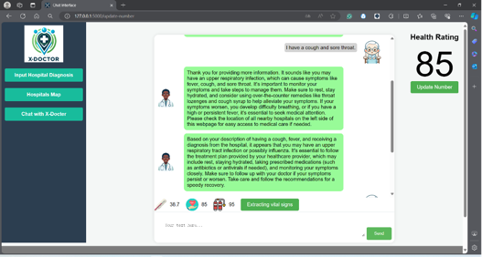
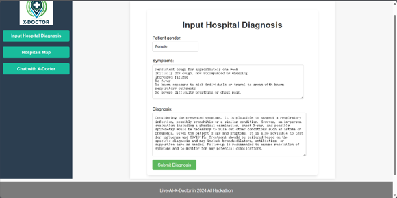
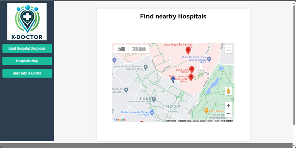

# Live AI hackathon 2024 - X-Doctor

> Team Name: All can be learned
> 
> Team Members: Qingqian Wang, Shanghui Yin, Yunze Zhang, Yongchang Liu

## Demo Video

[Youtube Video Here](https://youtu.be/3T22RZJzQhw)
&nbsp;&nbsp;

> Screenshot

## Inspiration
The inception of AIctor, our AI doctor project, was fueled by the urgent need to bridge the gap in healthcare accessibility, particularly for the elderly who often face difficulties in accurately communicating their symptoms. We observed that the conventional healthcare system sometimes struggles with patient overflow, leading to prolonged wait times and, consequently, delayed care. This scenario is even more challenging for elderly patients who may not use the correct medical terminologies or may forget to mention critical symptoms. Inspired by the potential of AI in transforming healthcare, we envisioned AIctor as a compassionate, intelligent companion that assists in overcoming these barriers, ensuring every patient feels heard and understood.

## What it does
AIctor acts as a virtual outpatient doctor specializing in primary care diagnoses. It is designed to interact with patients through an intuitive chat interface, asking guided questions to elicit more accurate and detailed descriptions of their conditions. Unlike a traditional doctor's visit, AIctor is available around the clock, providing immediate feedback and initial recommendations. This not only aids in early detection of potential health issues but also educates the patient on their possible conditions before they visit a healthcare professional in person.

## How we built it
We built AIctor using a combination of natural language processing (NLP) and machine learning algorithms, powered by the latest advancements in AI research (CHATGPT).

## Accomplishments that we're proud of
We are particularly proud of AIctor's ability to engage patients in a meaningful dialogue, making them feel comfortable and heard. Its development represents a significant step forward in making healthcare more accessible and immediate for those who need it most.

## What's next for AIctor
Looking ahead, we plan to expand AIctor's capabilities to cover more specialized fields of medicine, offering a broader range of diagnoses and recommendations. We also aim to incorporate voice recognition technology, making the platform even more accessible, especially for patients who may have difficulty typing or using a computer.

